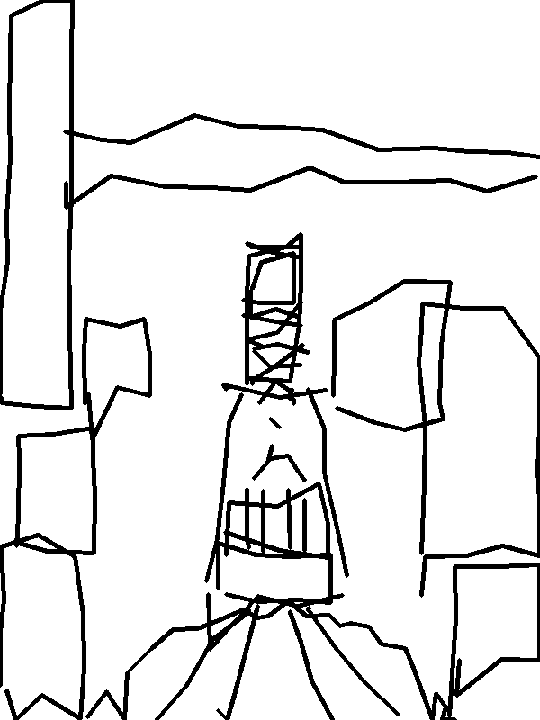

# Run bob-virtual-oracle-1: sacpaint-photo-v1_92a06a0b.json

> Draw the reference image on the canvas with the pen. You may look at the overhead camera to inspect your work and make corrections. Stop when you believe the drawing is complete.

| | |
|---|---|
| Created (UTC) | 2026-09-09T18:28:05.349672+00:00 |
| Task | sacpaint/photo-v1 |
| Policy | sacpaint_trace |
| Model | n/a |
| Effort | n/a |
| Wire | n/a |
| Embodiment | opencastor-virtual |
| Status | success |
| Termination | done |
| Steps | 649 |
| Duration | 61:37 |
| Epochs | 1 |
| Seed | 0 |
| inspect-robots | 0.58.0 |
| Git commit | 69a287a609690b0d1b46de2eb954343cf1c27b53 |
| Reference | sacpaint/photo-v1 |

## Scores

| scorer | mean |
|---|--:|
| composite | 0.820 |
| discipline | 0.867 |
| efficiency | 0.784 |
| landmark_geometry | 0.765 |
| structure | 0.912 |

| epoch | composite | discipline | efficiency | landmark_geometry | structure |
|--:|--:|--:|--:|--:|--:|
| 0 | 0.820 | 0.867 | 0.784 | 0.765 | 0.912 |

## Final canvases

### sacramento-photo-v1 epoch 0: composite 0.820

| landmark | presence | position | score |
|---|--:|--:|--:|
| buildings | 0.61 | 0.98 | 0.61 |
| capitol_dome | 0.54 | 0.92 | 0.52 |
| cupola | 0.86 | 0.99 | 0.85 |
| horizon | 0.95 | 0.96 | 0.93 |
| road | 0.96 | 0.98 | 0.95 |
| tower_bridge | 1.00 | 0.92 | 0.96 |

Files: [raw EvalLog](../sacpaint-photo-v1_92a06a0b.json) · [HTML report](../html/sacpaint-photo-v1_92a06a0b.html)
